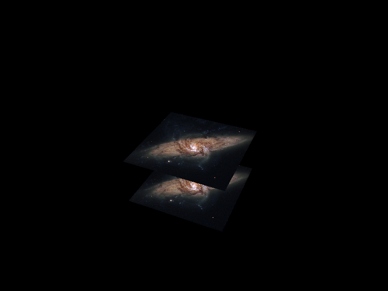

# Vulkan Tutorial

This is completly based on [this tutorial](https://vulkan-tutorial.com), all hail goes to this guy.

### General

Since I build this completely in Linux I can't assure it will run on Windows or OSX. But shouldn't be too hard to modify the project to your OS.

#### Dependencies
In order to build and run this, you'll need the following libraries and SDKs. As mentioned above this was built on Linux, specifically on ArchLinux, so I can provide hints only for this distribution:
* A Vulkan compatible graphics card and drivers. Refer to your OS and vendor for how-to install them. For ArchLinux it should be this:
  * ```$ sudo pacman -S vulkan-intel``` for Intel graphics (in my case)
  * ```$ sudo pacman -S vulkan-radeon``` for Radeon cards
  * Nvidia should have Vulkan support in their proprietary driver, which should be ```$ sudo pacman -S nvidia-utils```.
* The Vulkan SDK ```$ sudo pacman -S vulkan-devel```
* [GLFW Library](https://www.glfw.org/) ```$ sudo pacman -S glfw-x11```
* [GLSL](https://www.khronos.org/registry/OpenGL/index_gl.php) ```$ sudo pacman -S glslang```
* [GLM](https://glm.g-truc.net/0.9.9/index.html ) ```$ sudo pacman -S glm```
 
#### Build and run

* Clone the project:

```git clone https://github.com/tylernewnoise/VulkanTutorial.git```
* Build the shaders:
```
$ cd VulkanTutorial
$ cd shaders
$ ./compileShaders.sh
```
* Build the application:
 ```
 $ cd VulkanTutorial
 $ mkdir build
 $ cd build
 $ cmake ..
 $ make
```

* Run it:

```$ ./VulkanTut```

If everything went well you should see a spinning galaxy:


#### Credits

* [of course](https://vulkan-tutorial.com)
* brotcrunshers [youtube tutorial](https://www.youtube.com/watch?v=mzVFHEmnRLg&index=1&list=PL58qjcU5nk8uH9mmlASm4SFy1yuPzDAH0)
* Picture of galaxy from [here](https://www.flickr.com/photos/nasacommons/9467311154/in/photolist-fqArLE-bTceKc-8phfAM-npPhJ7-bTcCAt-r8td3y-bEha9y-fq2Sbf-bEha4f-r9nNFv-fqmbDn-8pkquq-bTcmwH-bEhcEN-bEhemC-bEhagb-otWLAH-qRWXqx-bEhfpJ-bTcfYn-bTcuj6-bEhVV5-8cJQMe-bTcBMc-bEhVUu-bEhCa5-do6zvq-bTbVRZ-btKxwX-npPh5b-bTcFfF-bEheEA-bEhWDj-fq17jY-qR79LP-bTbTSr-bTce3n-fpNgdH-bTcfYB-dCrz1Z-fq3kMf-bEhWkE-fqAYHf-Lct2bP-ZnqK2r-7hKa3t-QdxXBq-qR19hL-bTbVX8-i54VDR)
* [stb](https://github.com/nothings/stb) image library
* [Sascha Willems](https://github.com/SaschaWillems/Vulkan)


