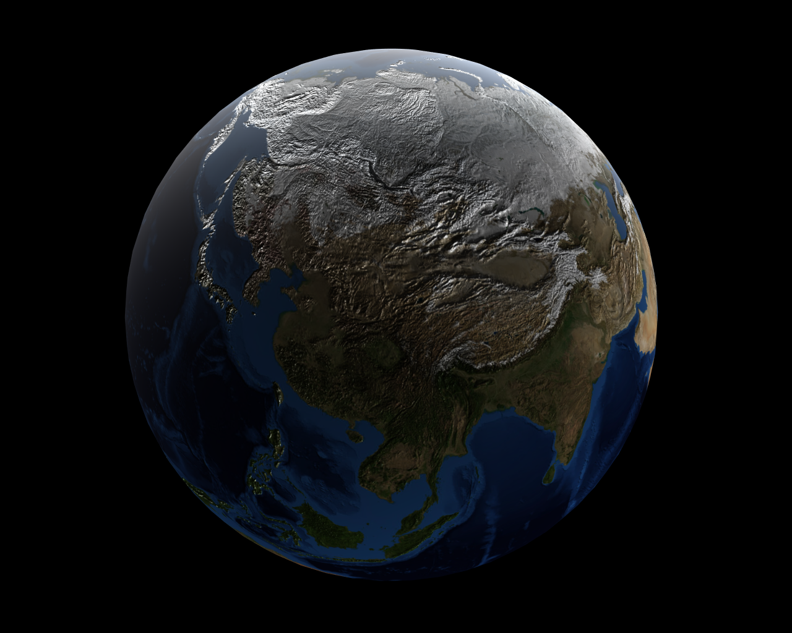
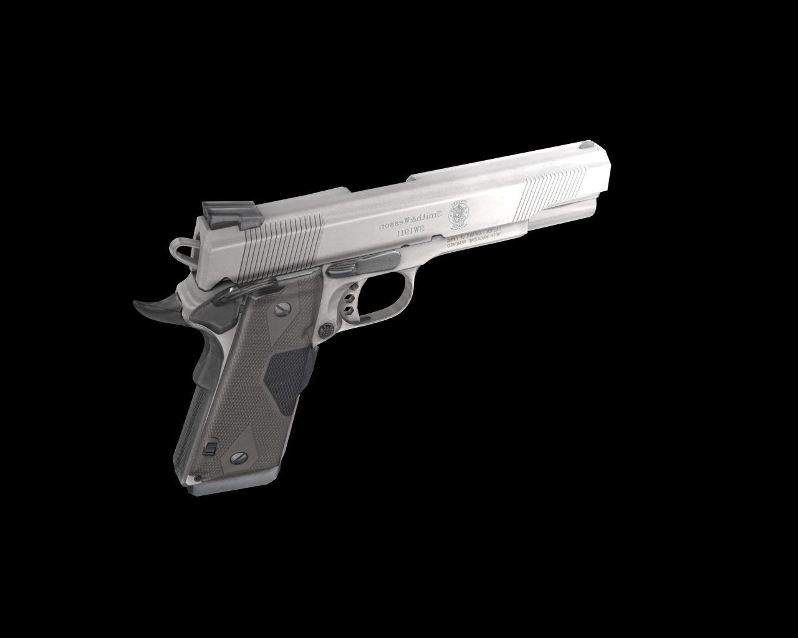

# Vulkan Tutorial

This is heavily based on [this tutorial](https://vulkan-tutorial.com), all hail goes to this guy.

### General

Since this is build completely in Linux it can't be assured it will run on Windows or OSX. But shouldn't be too hard to modify the project to your OS.

#### Dependencies
In order to build and run this, you'll need the following libraries and SDKs. As mentioned above this was built on Linux, specifically on ArchLinux, so hints can be provided only for this distribution:
* A Vulkan compatible graphics card and drivers. Refer to your OS and vendor for how-to install them. For ArchLinux it should be this:
  * ```$ sudo pacman -S vulkan-intel``` for Intel graphics (in my case)
  * ```$ sudo pacman -S vulkan-radeon``` for Radeon cards
  * Nvidia should have Vulkan support in their proprietary driver, which should be ```$ sudo pacman -S nvidia-utils```.
* The Vulkan SDK ```$ sudo pacman -S vulkan-devel```
* [GLFW Library](https://www.glfw.org/) ```$ sudo pacman -S glfw-x11```
* [GLSL](https://github.com/KhronosGroup/glslang) ```$ sudo pacman -S glslang```
* [GLM](https://glm.g-truc.net/0.9.9/index.html ) ```$ sudo pacman -S glm```
* [cmake](cmake.org) version >3.10
* g++ version >7.3.0
 
#### Build and run
* Clone the project:

```git clone https://github.com/tylernewnoise/VulkanTutorial.git```
* Build the shaders:
```
$ cd VulkanTutorial
$ cd data/shaders
$ ./compileShaders.sh
```
* Build the application:
 ```
 $ cd VulkanTutorial
 $ mkdir build
 $ cd build
 $ cmake ..
 $ make
```

* Run it:

```$ ./VulkanTut```

If everything went well you should see the earth or a gun (see below for example screenshots).

* Interactions:
    * 'l' turns the light on/off.
    * 'spacebar' starts/stops rotation
    * 'up/down' moves the camera to/away from object

#### Accomplishments

The example has implemented the following features (even though they are not _visible_):
* loading a 3D model
* loading a texture
* loading vertex and fragment shaders
* resizable window
* depth buffering
* [Phong shading](https://en.wikipedia.org/wiki/Phong_shading)
* [Mipmaps](https://en.wikipedia.org/wiki/Mipmap)
* [MultiSample AntiAliasing](https://en.wikipedia.org/wiki/Multisample_anti-aliasing)
* [Sample Shading](https://www.khronos.org/registry/vulkan/specs/1.0/html/vkspec.html#primsrast-sampleshading)
* [Normal Maps](https://en.wikipedia.org/wiki/Normal_mapping)

#### Bugs
* None known (which doesn't mean that there are none!)

#### Credits, resources, inspirations

* [vulkan tutorial](https://vulkan-tutorial.com)
* brotcrunshers [youtube tutorial](https://www.youtube.com/watch?v=mzVFHEmnRLg&index=1&list=PL58qjcU5nk8uH9mmlASm4SFy1yuPzDAH0)
* [stb](https://github.com/nothings/stb) image library
* [tinyobjloader](https://github.com/syoyo/tinyobjloader) object loader
* [Sascha Willems](https://github.com/SaschaWillems/Vulkan)
* [gun model](https://free3d.com/3d-model/45-acp-smith-and-wesson-13999.html)
* [earth model](https://free3d.com/3d-model/planet-earth-99065.html)
* [vulkan cookbook](https://github.com/PacktPublishing/Vulkan-Cookbook)

#### TODO
* http://kylehalladay.com/blog/tutorial/vulkan/2017/08/13/Vulkan-Uniform-Buffers.html
* PushConstants, Spitsceens, Instances, Shadows and so much more....
* refactor to a less rigid structure

#### Screenshots


